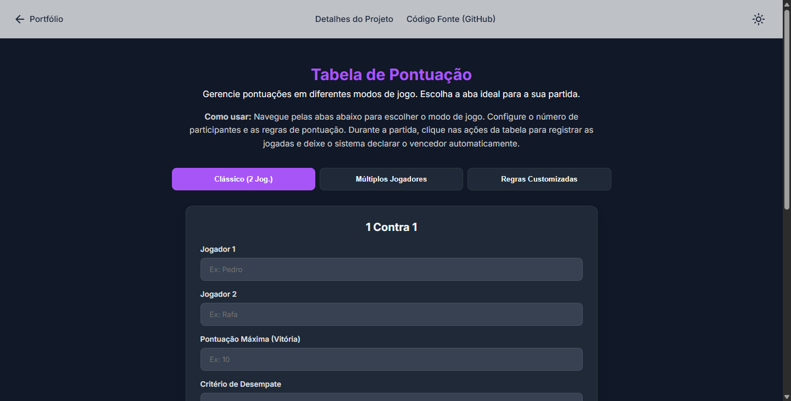

# 🏆 Tabela de Pontuação

Um gerenciador de pontuações dinâmico projetado para partidas, campeonatos e jogos casuais. Ele permite o controle de pontuações com cálculos automáticos, suporte a múltiplos jogadores e sistemas avançados de desempate.

Este projeto nasceu inspirado no desafio de Tabela de Classificação da **Imersão Dev da Alura**, mas foi **completamente reconstruído do zero**. A versão original (que utilizava lógicas engessadas e interações via `prompt` e `alert`) foi descartada em favor de uma arquitetura modular em abas, manipulação avançada de DOM, persistência de estado e uma interface gráfica moderna e fluida.

---

## ✨ Funcionalidades

### ⚙️ Modos de Jogo Inteligentes
* **Sistema de Abas (Single Page):** Navegação dinâmica entre 3 modos de jogo sem recarregar a página (Clássico 1v1, Multijogador e Regras Customizadas).
* **Escalabilidade Multijogador:** Suporta partidas de 3 a 10 jogadores. O sistema utiliza um Modal de Alvo flutuante inteligente que pergunta exatamente "Sobre quem foi a vitória?" ou "Com quem empatou?" para distribuir os pontos e as derrotas corretamente.
* **Regras Customizadas:** Permite definir pontuações personalizadas (ex: Vitória vale 5 pontos, derrota retira 1 ponto), garantindo flexibilidade para qualquer tipo de jogo.
* **Critérios de Desempate:** Para garantir disputas justas, o usuário pode definir se o desempate será decidido por "Diferença de Pontos" (vantagem isolada) ou "Maior número de Vitórias".

### 💾 Persistência de Dados e UX
* **Recuperação Automática (Local Storage):** O sistema salva localmente cada nova atualização nos pontos. Se a página for fechada ou atualizada sem querer, um modal de recuperação oferece a opção de continuar exatamente de onde o jogo parou.
* **Validação e Interface Limpa:** Substituição de pop-ups intrusivos por formulários em tela (que suportam envio via tecla `Enter`) e *tooltips* explicativos sutis nos formulários.

### 🔒 Design System & Privacy by Design
* **Vanilla HTML/CSS/JS:** Construído sem frameworks, demonstrando domínio das tecnologias base da web e de regras de negócio complexas.
* **Modo Claro / Escuro:** Toggle de tema persistente (salvo no `localStorage`), utilizando variáveis globais CSS (`:root`) para transições de cores em toda a aplicação.
* **Privacy by Design:** Proteção de dados pensada desde a arquitetura. Os nomes e dados da partida são processados exclusivamente de forma local no navegador do usuário, sem coleta ou envio para bancos de dados externos.

---

## 🚀 Tecnologias Utilizadas

* **HTML5:** Estrutura semântica, formulários com validações nativas e atributos de acessibilidade.
* **CSS3:** Variáveis CSS nativas, Flexbox para estrutura flexível, manipulação de estado via classes dinâmicas, *Glassmorphism* no cabeçalho e transições suaves.
* **JavaScript (ES6+):** Delegação e escuta de Eventos, manipulação direta do DOM, iterações em Arrays de Objetos, lógica assíncrona com `setTimeout` e gerenciamento de estado global com `localStorage`.
* **APIs e Recursos Visuais:** 
  * Google Fonts (Inter, Roboto Mono)
  * Material Symbols (Ícones do Google)

---

## ⚙️ Como rodar o projeto localmente

Como o projeto utiliza apenas tecnologias nativas do navegador, não é necessário instalar dependências (como `npm` ou `yarn`).

1. Faça o clone deste repositório: `git clone https://github.com/GitAkzo/Tabela-Pontuacao.git`

2. Acesse a pasta do projeto: `cd Tabela-Pontuacao`

3. Abra o arquivo `index.html` diretamente no seu navegador de preferência, ou utilize a extensão Live Server do VS Code para emular um servidor local.

---

### 💡 Não quer baixar o código?
Sem problemas! Você pode testar a aplicação agora mesmo direto no seu navegador:

Para mais detalhes, acesse a página do projeto no meu portfólio:

---

## 👨‍💻 Autor

**Paulo Rasec** | Engenheiro de Software | Desenvolvedor Web | Pós-graduando em Direito Digital e LGPD

---

## 📝 Licença

Este projeto está sob a licença MIT.